# Magnolia Lean AI Toolkit

Small, focused AI helpers for [Magnolia CMS](https://www.magnolia-cms.com/) (Community Edition) editors and admins — built with [LangChain4j](https://docs.langchain4j.dev/) on top of local (Ollama) or cloud (OpenAI, Anthropic) LLMs.

The toolkit is organized as a growing collection of independent, single-purpose modules rather than one monolithic AI module. Each module targets one concrete editorial or administrative pain point and can be added to a Magnolia instance on its own.

## Modules

| Module | What it does | Status |
|---|---|---|
| [`magnolia-lean-ai-factchecker-module`](magnolia-lean-ai-factchecker-module) | Extracts factual claims from page content and verifies them against Wikipedia, right from the Pages app | ✅ Available |

---

## FactChecker

An editor selects a piece of content (e.g apage or a component) in the Magnolia Pages App or any other content app, triggers a **"Fact Check"** action, and gets a message-center notification listing every factual claim found on the page, together with a verdict (`CORRECT` / `INCORRECT` / `UNVERIFIABLE`), an explanation, and a source link — without leaving Magnolia or copy-pasting content into an external tool.

### Why

Editorial content drifts: a figure gets outdated, a person's title changes, a fact gets misremembered during a rewrite. Nobody re-verifies published pages against a source of truth as a matter of routine. FactChecker makes that check a one-click, in-workflow action instead of a separate research task — the kind of AI-assisted quality gate that complements Magnolia's own [AI Accelerator](https://www.magnolia-cms.com/) rather than duplicating it.

### How it works

```
Editor clicks "Fact Check"  (Pages app action bar)
        │
        ▼
FactCheckCommandAction  ──▶  FactCheckerCommand  ──▶  FactCheckerServiceImpl
        │                                                     │
        │                                    ┌────────────────┴────────────────┐
        │                                    ▼                                 ▼
        │                            ClaimExtractor                      FactChecker
        │                       (LLM: text → claims)              (LLM: claim → verdict,
        │                                                          calls WikipediaTool)
        ▼
Result posted back as a message
(Magnolia message center)
```

- **`ClaimExtractor`** turns the page's text properties into a list of self-contained, independently verifiable claims — deliberately excluding opinions, marketing language, and unstated inferences (see the system prompt in `src/main/resources/prompts/`).
- **`FactChecker`** checks each claim individually, calling a `wikipediaLookup` tool to look up the relevant entity before deciding on a verdict.
- Both steps use independently configured chat models (see [Configuration](#configuration-reference) below) — extraction favors a low-temperature, instruction-following model; fact-checking favors a model with reliable tool-calling.
- Supports **Ollama** (local, default), **OpenAI**, and **Anthropic** as model providers. API keys for cloud providers are stored as node references into Magnolia's own Passwords App keystore, never as plaintext config values.

### Editor workflow

| Pages app — browse to a page | Pages app — detail view with the Fact Check action |
|---|---|
| 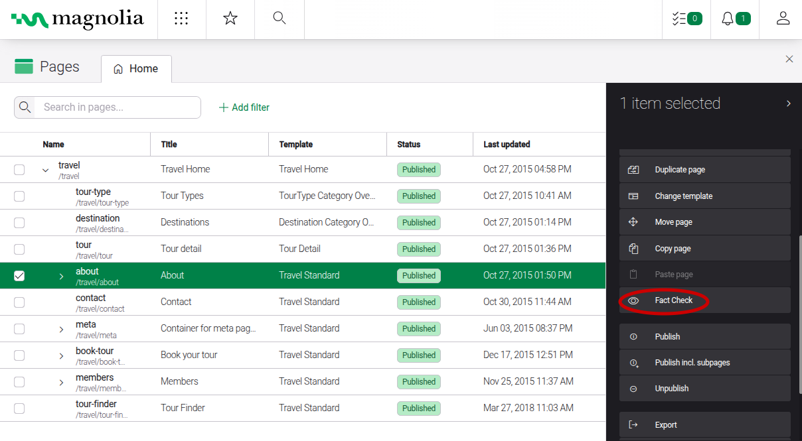 | 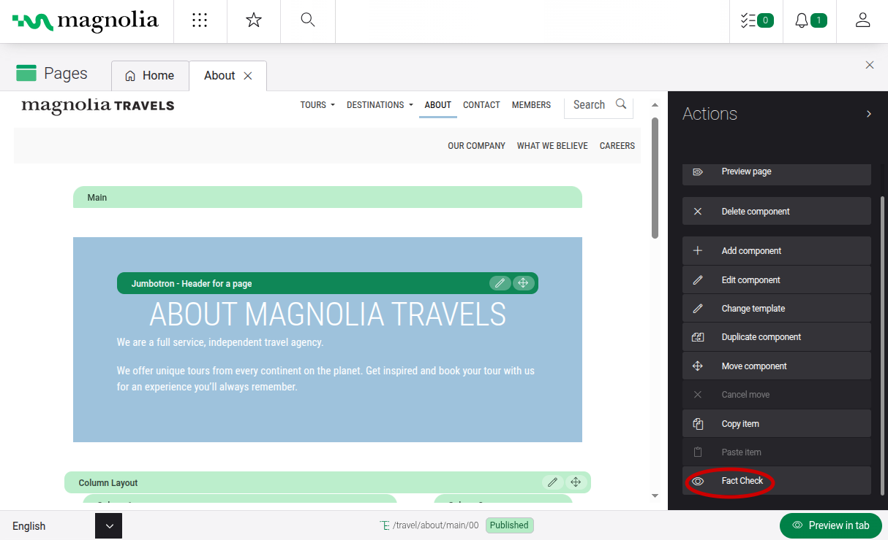 |

| Tours app — select content and trigger "Fact Check"... | ...which results in a notification in the message center |
|---|---|
| 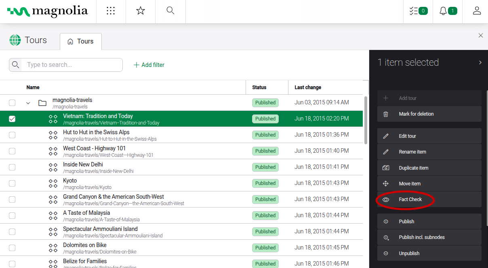 | 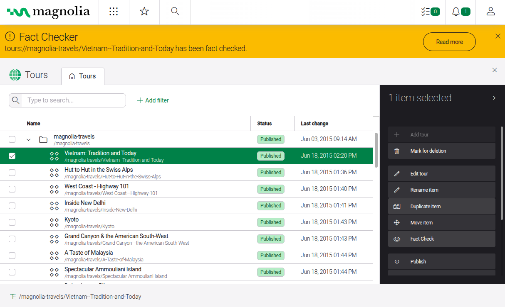 |

| Full result: one entry per extracted claim |
|---|
| 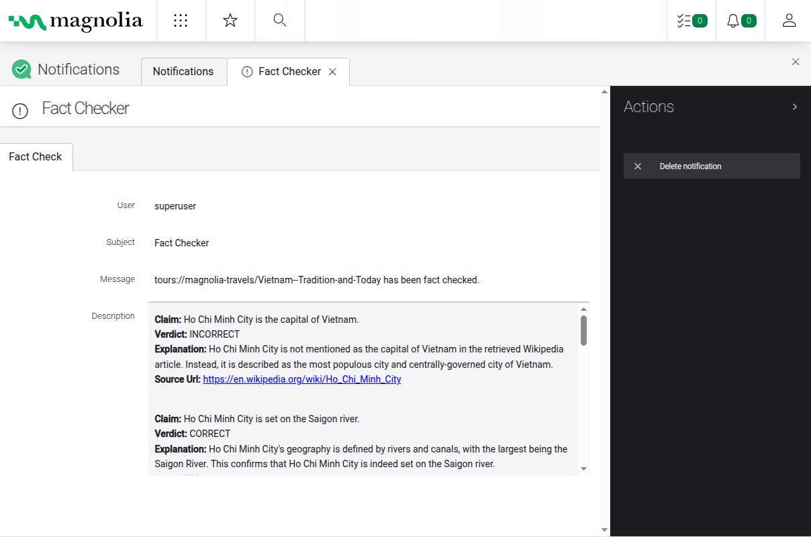 |

### Admin configuration

The module is configured through standard Magnolia light-module YAML — no custom admin UI. Below is what that configuration looks like in the Configuration app, for orientation; see [`config.md`](magnolia-lean-ai-factchecker-module/config.md) for the full property reference.

| Command (`factChecker`) | Fact Check action |
|---|---|
| 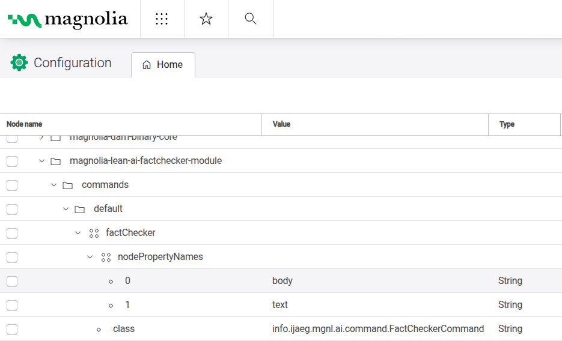 | 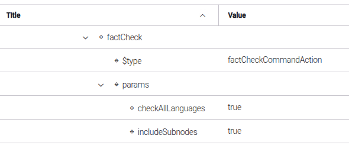 |

| Result message view | Wikipedia REST client |
|---|---|
| 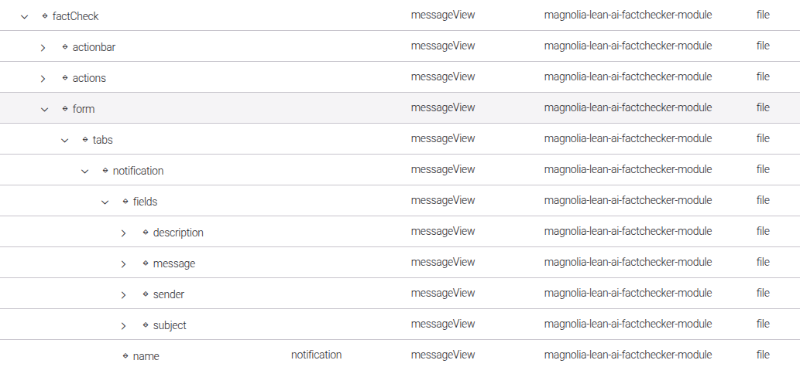 | 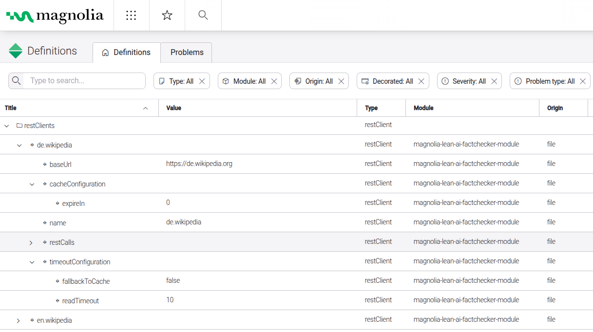 |

| Wikipedia search call | Wikipedia summary call |
|---|---|
| 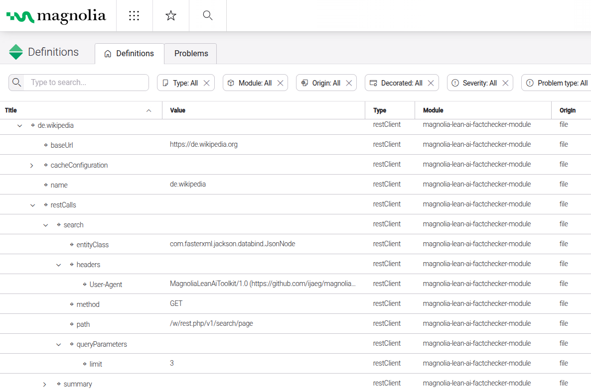 | 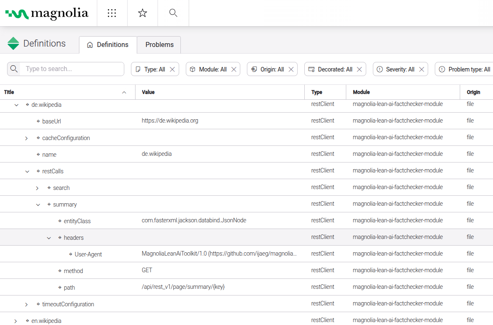 |

### Setup

1. **Run Ollama locally** (default provider) and pull the models referenced in `config.yaml`:
   ```
   ollama pull qwen2.5:7b-instruct         # claim extraction
   ollama pull llama3.1:8b-instruct-q4_K_M # fact checking
   ```
2. **Build the module**:
   ```
   mvn -pl magnolia-lean-ai-factchecker-module clean install
   ```
3. **Deploy** the `magnolia-lean-ai-toolkit-webapp` WAR to a local Tomcat (or your preferred servlet container) and start Magnolia.
4. To use **OpenAI or Anthropic** instead of Ollama for either step, store the API key in Magnolia's Passwords App and set `providerType`/`apiKey` accordingly in `config.yaml` — see [`config.md`](magnolia-lean-ai-factchecker-module/config.md).

### Testing

```
mvn test    # unit tests (WikipediaTool, FactCheckerServiceImpl, ChatModelFactory, ...) — no Ollama required
mvn verify  # adds prompt regression tests (ClaimExtractorRegressionIT / FactCheckerRegressionIT) — requires a running Ollama with both models pulled
```

The regression tests exercise the real prompts against a live model, using a fake Wikipedia tool and a self-contained fictional test world (so results depend only on the prompt logic and tool-calling behavior, not on the model's own world knowledge). See `CLAUDE.md` for the full rationale and known model-specific pitfalls encountered while building this.

### Known limitations

- Only Wikipedia is used as a verification source; claims outside Wikipedia's coverage are reported as `UNVERIFIABLE`, not researched further.
- Results are reported claim-by-claim in a message, without highlighting the corresponding passage in the page content itself.
- Verified primarily against quantized 7–8B local models (`qwen2.5:7b-instruct`, `llama3.1:8b-instruct-q4_K_M`); larger or cloud models will likely need less prompt scaffolding, smaller models may need more.

### Configuration reference

Full list of configuration properties, defaults, and gotchas: [`magnolia-lean-ai-factchecker-module/config.md`](magnolia-lean-ai-factchecker-module/config.md)

---

## Requirements

- Java 21
- Maven
- Magnolia CMS Community Edition 6.4.x
- A servlet container (e.g. Tomcat) to run the webapp
- [Ollama](https://ollama.com/) running locally (default provider) — or an OpenAI/Anthropic API key

## License

[GNU General Public License v3.0](LICENSE.md)
